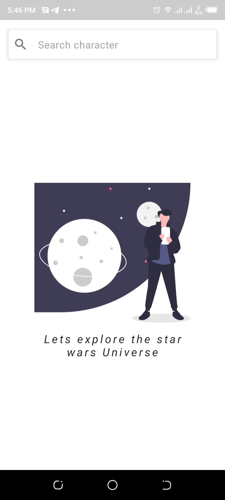
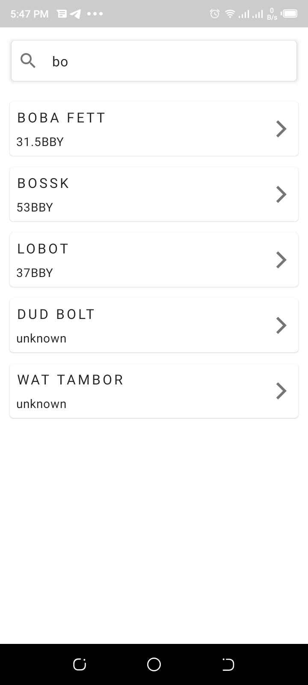
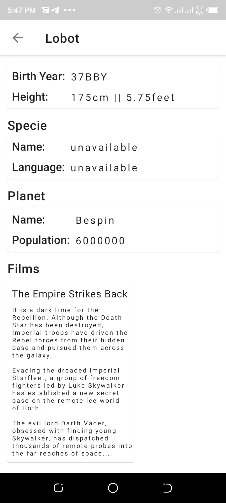
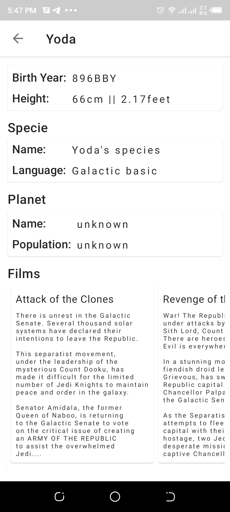
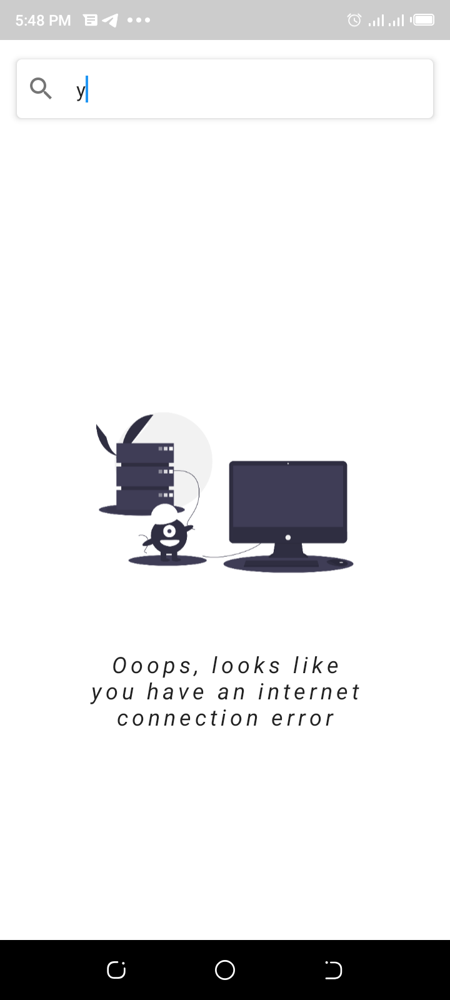

# StarWarsSearch
An Android Application interacting with [Star Wars API](https://swapi.dev/). It enabling users to search for Star Wars Characters and get their Details from the Star Wars Universe. 

## Development Environment
* Android Studio: Arctic Fox Canary 4 or Higher
* Language: Kotlin
* Build System: Gradle

## Features
* Clean Architecture + Model View Model Model Pattern + Repository Pattern.
* Jetpack Libraries and Architecture Component
* Github Action for CI
* Kotlin Gradle DSL

## Architecture
Clean architecture helps organizing the project into different layers so that it's easy to understand, scale and debug when need arises.
There are [Multiple ways of defining Clean Architecture layers](https://proandroiddev.com/multiple-ways-of-defining-clean-architecture-layers-bbb70afa5d4a).
In this application i have used Clean Architecture per module. 

The project is divided into 3 layers
* domain
* data
* app

### Domain
This is the layer that contains all the business logic. It contains all the abstract definition and the inner most. It is completely made of java/kotlin module
In this project the domain layers holds the definitions of use-cases/iteractors, domain data models and repository interfaces. 

```usecases/ interactors```  they are the business logic executors that converts and passes user actions like fetch data from data source either remote or local and gives it back to the requester, in this case its the presenter (app).
the act as mediators between the repository and data layer

```repository interface``` interface that must be implemented by data layer

### Data
The data module consists of network models, mappers, API services, and repository implementations. This is the layer that repository patter is implemented. Repository pattern is used to abstract 
away concrete implementation of data source

```mappers```  they are used to convert/maps one data type to the other eg network model to domain model

In this project, i have only implemented the ```network data source``` where data is only fetched from the internet.

### Presentation (App)
This layer contains the implementation of the three inner layers. This layers contains  User Interface, mainly Android Stuff like Activities, Fragments, ViewModel, 


## Testing
Testing is done in each layer. Thats one of the advantages of Clean Architecture

```domain``` in the domain layer test is done using ```JUnit4``` to the use cases. Fake data is used to test the Repository to interact with the use case to assert that the correct data is returned. 

```data``` in this layer test to the repository implementation and mappers. The mappers test is used to certify that the mapper maps the correct data and returns the correct type.
The Repository is tested using ```webmockserver```. This enables us to test if the converter and the correct data is returned in each case.

```app``` in this layer both ```instrumental``` and ```unit``` test are done. ViewModels are tested to assert that the usecase interact with the repository to fetch data from the repository in the data layer
Fake Data are used to test the Viewmodel. Mappers are also tested to verify the domain data model is converted to presentation layer correctly. UI test are done to verify that the correct data is presented to the user and that the user interaction are handled. 

# Libraries
* [Android Jetpack](https://developer.android.com/jetpack)
   * [Data Binding](https://developer.android.com/topic/libraries/data-binding/) The Data Binding Library is a support library that allows you to bind UI components in your layouts to data sources in your app using a declarative format rather than programmatically.
   * [Live Data](https://developer.android.com/topic/libraries/architecture/livedata) LiveData is lifecycle-aware, meaning it respects the lifecycle of other app components updating app component observers that are in an active lifecycle state.
   * [Navigation](https://developer.android.com/guide/navigation/) Android Jetpack's Navigation component helps you implement effective navigation.
   * [Hilt](https://dagger.dev/hilt/) Hilt provides a standard way to incorporate Dagger dependency injection into an Android application.
* [Kotlin coroutines](https://developer.android.com/kotlin/coroutines) Executing code asynchronously.
* [Retrofit](https://square.github.io/retrofit/) Type-safe HTTP client for Android and Java and Kotlin by Square, Inc. 
* [Moshi](https://github.com/square/moshi) Moshi is a modern JSON library for Android and Java. It makes it easy to parse JSON into Java objects:
* [OkHttp interceptor](https://github.com/square/okhttp/tree/master/okhttp-logging-interceptor) Logs HTTP requests and responses
* [Material Design](https://material.io/develop/android/) Build beautiful, usable products using Material Components for Android
* [JUnit4](https://junit.org/junit4/) Unit Testing
* [Espresso](https://developer.android.com/training/testing/espresso) Automated testing UI test
* [MockWebServer](https://github.com/square/okhttp/tree/master/mockwebserver) A scriptable web server for testing HTTP clients

## Demo
|
|
|
|
|
|

#References

## Articles
* [Why do we need Clean Architecture?](https://www.droidcon.com/media-detail?video=481190265)
* [detailed-guide-on-android-clean-architecture](https://medium.com/android-dev-hacks/detailed-guide-on-android-clean-architecture-9eab262a9011)
* [clean-architecture-tutorial-for-android-getting-started](https://www.raywenderlich.com/3595916-clean-architecture-tutorial-for-android-getting-started#toc-anchor-013)
* [Multiple ways of defining Clean Architecture layers](https://proandroiddev.com/multiple-ways-of-defining-clean-architecture-layers-bbb70afa5d4a)

